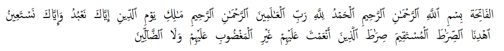
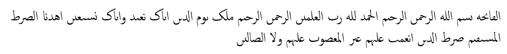

# Description

Reduce arabic text to its rasm, i.e. remove vocalization marks, diacritics so you only are left with a *basic consonant skeleton*.

For example, the first verse of the Qur'an as found on [corpuscoranicum.de](http://corpuscoranicum.de/index/index/sure/1/vers/1):

Compare the following examples:

**Text with diacritics etc**


**Text without diacritics (rasmified)**


# Installation

Require this package using npm. Run the following command in the terminal:


```
npm install rasmify.js
```

# Usage

To convert an arabic string to its *rasm*, use the following code:

```javascript
var rasmify = require('rasmify');

var arabicString = 'الفَاتِحَة';

// Should output الڡاٮحه
rasmify(arabicString);
```